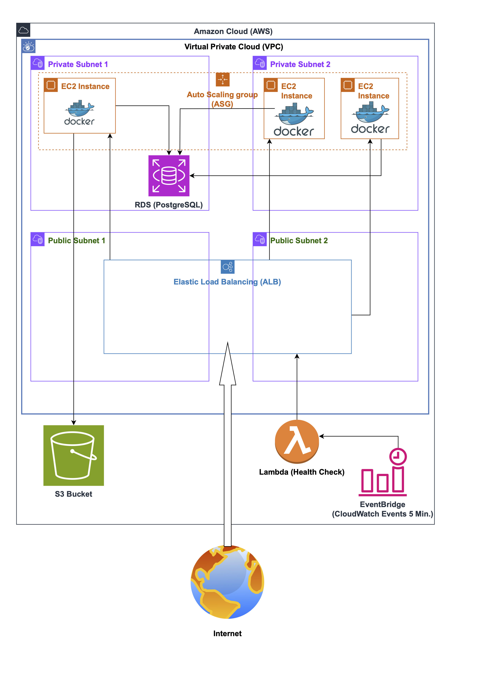

# GroceryMate AWS Version 2 🚀

This project provides a complete, production-ready AWS infrastructure for the GroceryMate e-commerce application, using Terraform.
It explains step by step how to deploy, connect, and run GroceryMate on AWS – including all common obstacles and special tips for students or beginners.

If you are new to AWS or Terraform, don’t worry! Every step is explained in detail and includes troubleshooting for common errors.

> **Focus:**  
> This repository covers **the AWS infrastructure and how to get the GroceryMate app running in the cloud**.  
> For the app source code itself, see [Alejandro’s GroceryMate repository](https://github.com/AlejandroRomanIbanez/AWS_grocery.git).

[](https://www.python.org/)
[](https://www.postgresql.org/)
[](https://aws.amazon.com/)
[](https://github.com/AlejandroRomanIbanez/AWS_grocery/releases)


---

## 📖 Table of Contents

- [Overview](#overview)
- [Features](#features)
- [Architecture](#architecture)
- [Project Structure](#project-structure)
- [Prerequisites](#prerequisites)
- [Infrastructure Setup (Terraform)](#infrastructure-setup-terraform)
- [SSH Key Setup](#ssh-key-setup)
- [Application Setup (Backend)](#application-setup-backend)
- [Migrating from Local PostgreSQL to AWS RDS (Step by Step)](#migrating-from-local-postgresql-to-aws-rds-step-by-step)
- [Screenshots & Demo](#screenshots--demo)
- [Usage](#usage)
- [Troubleshooting](#troubleshooting)
- [Contributing](#contributing)
- [License](#license)


---


##  Overview

GroceryMate AWS Version 2 lets you deploy a full e-commerce platform in the AWS cloud – with modern, scalable architecture, all managed using Terraform.  
This repository focuses on making cloud deployment and app integration easy and understandable for learners.

---

##  Features

**App Features:**
- Secure user authentication (registration, login, sessions)
- Role-based access control (protected routes)
- Product search and filtering
- Favorites management
- Shopping basket with add, modify, remove
- Checkout with multiple payment options

**AWS Infrastructure Features:**
- Modular, reusable Terraform setup
- Highly available architecture (VPC with public/private subnets)
- EC2 instances for app deployment (Docker)
- Application Load Balancer (ALB) for traffic management
- Managed PostgreSQL RDS database
- S3 bucket for static assets
- Lambda function for periodic ALB health checks (triggered by EventBridge)
- IAM roles and policies for secure access
- Easily extensible and reproducible setup


---

##  Architecture

The GroceryMate AWS infrastructure uses a modular and secure design, fully managed with Terraform.  
All important AWS building blocks are included for a real-world, scalable web application.



This diagram shows the main AWS resources, how they are connected, and how data flows between them.  
Each box or icon stands for one piece of the cloud setup.

**Key AWS components explained simply:**

- **VPC (Virtual Private Cloud):**  
  Think of this as your own private “apartment” in AWS where all your other resources (servers, databases, etc.) safely live together.
- **Public Subnets:**  
  The “rooms” in your VPC that can talk to the outside world (the Internet).  
  Used for resources like the Load Balancer.
- **Private Subnets:**  
  The “rooms” that are protected from the Internet.  
  Used for resources that should not be directly accessible (like databases or backend servers).
- **EC2 Instances:**  
  Virtual computers in the cloud that run your GroceryMate application (with Docker).
- **ALB (Application Load Balancer):**  
  Like a traffic manager that receives requests from users and sends them to healthy EC2 servers.
- **RDS (PostgreSQL):**  
  A managed database service – a safe place for your data (users, products, orders).
- **S3 Bucket:**  
  A storage box for static files, images, and backups.
- **Lambda Function:**  
  A “cloud helper” that regularly checks if your Load Balancer (ALB) and app are healthy.  
  Runs automatically, no server needed.
- **EventBridge:**  
  Like a timer or alarm clock that tells the Lambda when to run.
- **IAM:**  
  AWS’s way to manage who (or what) is allowed to do what in your cloud setup.

---

### Special Note about NAT Gateway

A **NAT Gateway** is a special AWS component that lets servers in the private subnets connect to the Internet securely (for example, to download software updates).  
This is important for production systems but can be expensive and requires extra AWS permissions.

- The Terraform code for the NAT Gateway setup is already included in [`modules/main_vpc.tf`](infrastructure/my_terraform_project/modules/vpc/main_vpc.tf), but it is currently **commented out**.
- Why? With my AWS student account, I do not have enough permissions to create a NAT Gateway (specifically, the `ec2:AllocateAddress` right, which must be approved by an AWS Admin).
- **Workaround:**  
  For testing purposes, I manually created the NAT Gateway in the AWS Console, because my account did not allow automated creation via Terraform.
- If you have full AWS permissions, you can uncomment the code and use it. The code should work as expected.

> _Reason for being commented out:_  
> ```
> # For the next steps I need the Admin right ec2:AllocateAddress because:
> # Error: UnauthorizedOperation: You are not authorized to perform: ec2:AllocateAddress
> ```

---

This architecture is designed to be robust, secure, and easy to understand – especially for beginners.  
If you are new to AWS, take your time to review the diagram above and read through these explanations.  
Whenever you encounter something unclear, you can always refer back to this section for orientation!


##  Project Structure

Below you see the most important folders and files in this repository:

```plaintext
AWS_grocery_version2/
├── .idea/
├── .terraform/
├── backend/
├── docs/
├── frontend/
├── infrastructure/
│   └── my_terraform_project/
│       ├── build/
│       ├── modules/
│       │   ├── ALB_ASG/
│       │   ├── ec2/
│       │   ├── IAM/
│       │   ├── lambda/
│       │   ├── RDS/
│       │   ├── S3-Bucket/
│       │   └── vpc/
│       ├── scripts/
│       │   ├── install_docker.sh
│       │   └── lambda_health_check_template.py
│       ├── build_lambda_zip.sh
│       ├── main.tf
│       ├── outputs.tf
│       ├── terraform.tfvars.example
│       ├── variables.tf
└── README.md
```

**What are these files for?**

- `.idea/`, `.terraform/`  
  → System/IDE folders. Usually not relevant for infrastructure or app setup.

- `backend/`  
  → Contains the backend application code (e.g. Python, Flask). This is where all server-side logic, API, and database communication happens.

- `docs/`  
  → Contains the main architecture diagram for the GroceryMate AWS setup.

- `frontend/`  
  → Contains the frontend application code (e.g. React, JavaScript). This is what the user sees and interacts with in their web browser.

- `build`
  → Lambda build artifacts directory. 
    All build results (such as `lambda.zip` for AWS Lambda deployment) are stored in the `infrastructure/my_terraform_project/build/` directory. This directory is excluded from version control and does not need to be pushed to the repository. To build the Lambda deployment package, use your build script or zip the necessary files manually, then deploy the `lambda.zip` to AWS as needed.

- `modules/`  
  → Contains all reusable Terraform modules for the AWS infrastructure. Each subfolder (like `ALB_ASG`, `ec2`, `IAM`, `lambda`, `RDS`, `S3-Bucket`, `vpc`) manages a specific AWS resource or service.  
     Each module typically includes its own `main.tf`, `outputs.tf`, and `variables.tf` files.

- `scripts/install_docker.sh`  
  → Bash script to install Docker on your EC2 instances (so the app can run in containers).

- `scripts/lambda_health_check_template.py`  
  → Python template for the Lambda function that regularly checks if the Application Load Balancer (ALB) is working correctly.

- `build_lambda_zip.sh`  
  → Helper script to package (zip) the Lambda function code and its dependencies, so you can upload it to AWS Lambda.

- `terraform.tfvars.example`  
  → Example file with all required variables for Terraform. Copy it to `terraform.tfvars` and fill in your personal values (like VPC IDs, subnet IDs, DB password, etc.).  
     **Never commit secrets or real credentials!**

- `main.tf`, `outputs.tf` (output variables), `variables.tf` (input variables)  
  → Main Terraform configuration files that define, describe, and output the AWS infrastructure.


##  Prerequisites

Before you start, make sure you have **all the following installed and set up**:

- [Terraform](https://www.terraform.io/downloads.html) (version 1.4 or newer)  
  _Infrastructure-as-Code tool for AWS automation_

- [AWS CLI](https://docs.aws.amazon.com/cli/latest/userguide/getting-started-install.html)  
  _Command-line tool to connect Terraform to your AWS account_  
  ➔ **Configure it with `aws configure` and your AWS credentials!**

- [Python 3.11+](https://www.python.org/downloads/)  
  _Needed for the backend application (and for some scripts)_

- [PostgreSQL](https://www.postgresql.org/download/)  
  _Database server for the GroceryMate app_

- [Git](https://git-scm.com/)  
  _To clone/download this repository_

**Optional but recommended:**  
- A code editor (e.g. PyCharm or VS Code)
- A basic understanding of the AWS console (helpful for debugging, not required for pure Terraform users)

---

> **Important:**  
> You will also need an AWS account with enough permissions to create VPCs, EC2, RDS, S3, IAM, and Lambda resources.  
> If you only have a student or free-tier AWS account, some services (like NAT Gateway) may require special permissions or extra costs.  
> If you run into “UnauthorizedOperation” errors, check your AWS user rights.

> **Budget & AWS Costs Notice:**  
> Deploying real AWS infrastructure can incur costs!  
> - Many services (like EC2, RDS, S3, NAT Gateway, Lambda) are *not* completely free.
> - Always check the [AWS Free Tier](https://aws.amazon.com/free/) to understand what is covered.
> - For learning and testing, remember to **delete unused resources** after you are done (with `terraform destroy`).
> - If you see unexpected costs in your AWS account, review your running resources in the [AWS Console](https://console.aws.amazon.com/).
> - **NAT Gateway** in particular is often **not free** and can quickly become expensive.

If you have a limited AWS budget or a student account, it’s best to monitor costs and use only the minimum resources for your testing.


##  Infrastructure Setup (Terraform)

This section shows you how to create all required AWS infrastructure (VPC, EC2, RDS, etc.) automatically using Terraform.


### 1. Fork and Clone this Repository

If you haven’t already, fork/clone this project to your local computer:
1. Click the **"Fork"** button at the top right of this GitHub repository to create your own copy in your GitHub account.
2. Clone your own fork to your computer:

```bash
git clone https://github.com/<YOUR_GITHUB_USERNAME>/AWS_grocery.git
cd AWS_grocery
```

### 2. Prepare `terraform.tfvars`

Copy the example variables file:

```bash
cp terraform.tfvars.example terraform.tfvars
```
Edit ```terraform.tfvars``` to include your **real** AWS resource IDs. 
You can find these in the AWS console if you created the VPC and subnets manually.


> **Note:**  
> The VPC and subnets must be created **manually** in your AWS account before running Terraform.
> 
> You need to copy the IDs of your existing VPC and subnets into the `terraform.tfvars` file, for example:
>
> ```hcl
> public_subnet_ids = [
>   "subnet-07xxxxxxxxxxxxxxx",
>   "subnet-0cxxxxxxxxxxxxxxx"
> ]     # IDs of the public subnets in your AWS account
> 
> vpc_id = "vpc-04xxxxxxxxxxxxxxx"   # ID of your existing VPC
> ```
>
> If you skip this step or use IDs that do not exist in your AWS account,  
> `terraform plan` will fail with an error.


### 3. Initialize Terraform

```bash
terraform init
```
This command initializes Terraform in your project folder.
It downloads the required provider plugins and prepares the backend, so Terraform is ready to work with your AWS account.


### 4. Plan the infrastructure

```bash
terraform plan
```
This command creates an execution plan.
Terraform shows you which resources it will create, change, or destroy, without making any changes yet.
This helps you see what will happen before you apply the changes.


### 5. Apply the infrastructure

```bash
terraform apply
```
This command applies the planned changes to your AWS account.
Terraform creates, updates, or destroys resources so your cloud matches the configuration in your code.
You may be prompted to confirm the action before it starts.


### 6. Cleaning Up (Destroying Resources)

To avoid AWS costs after testing, you can delete everything with:

```bash
terraform destroy
```
> **Important:**  
> Always run `terraform destroy` when you are finished testing or no longer need the AWS resources.  
> Otherwise, you may continue to incur AWS charges, even if you are not actively using the infrastructure.  
>  
> This is especially important when using paid services like EC2, RDS, or NAT Gateway, which can quickly generate costs if left running.


##  SSH Key Setup

To connect to your EC2 instances (virtual servers) via SSH, you need an SSH key pair:  
- A **private key** (stays on your computer)  
- A **public key** (is uploaded to AWS and used by Terraform)

### 1. Generate an SSH Key Pair

Open a terminal and run:

```bash
ssh-keygen -t rsa -b 4096 -f ~/.ssh/terraform_ssh_key
```
- Press Enter to accept the default location. You can leave the passphrase empty (just press Enter), or set one if you want extra security. This will create two files:

```~/.ssh/terraform_ssh_key``` → private key (keep this safe!)

```~/.ssh/terraform_ssh_key.pub``` → public key (used in Terraform)

### 2. Reference Your Public Key in Terraform

- Terraform needs the **absolute path** to your public key (not `~`, but e.g. `/home/<yourusername>/.ssh/terraform_ssh_key.pub`).

- In your Terraform configuration (for example in `terraform.tfvars` or directly in the `aws_key_pair` resource), use the full path to your `.pub` file.

**Example:**

```hcl
resource "aws_key_pair" "terraform_key" {
  key_name   = "terraform_ssh_key"
  public_key = file("/home/<yourusername>/.ssh/terraform_ssh_key.pub")
}
```
> 🔄 **Replace `yourusername` with your own system username!**


### 3. Use the Private Key to Connect to EC2

After Terraform has created your infrastructure, find your EC2 instance’s public IP address (in the AWS Console or from Terraform outputs).

- Connect via SSH:

```bash
ssh -i ~/.ssh/terraform_ssh_key ec2-user@<your-ec2-public-ip>
```
- For **Amazon Linux**, the username is usually ```ec2-user```

---

**Tips & Troubleshooting:**

- Make sure your EC2 Security Group allows incoming SSH traffic (port 22).

- Never share your private key (```terraform_ssh_key```) with anyone.

- If you lose your private key, you cannot access your EC2 instance.

- If you see a ```"Permission denied"``` error: double-check the username and the correct path to your private key.

- If you change the key, re-run ```terraform apply``` to update the EC2 configuration.


##  Application Setup (Backend)

After your AWS infrastructure is deployed, you can set up and run the GroceryMate backend application on your EC2 instance(s).

### 1. Connect to your EC2 instance

Use SSH and your private key:

```bash
ssh -i ~/.ssh/terraform_ssh_key ec2-user@<your-ec2-public-ip>
```
### 2. Install Docker (if not already installed)

Run the provided script to install Docker:

```bash
cd scripts
sudo bash install_docker.sh
```

Check if Docker is working:

```bash
docker --version
```

### 3. Clone the Application Repository (if not already present)

Still on your EC2 instance:

```bash
git clone --branch version2 https://github.com/AlejandroRomanIbanez/AWS_grocery.git
cd AWS_grocery
```


### 4. Set Up the Database Connection

**Make sure your PostgreSQL RDS instance is up and you have the credentials ready.**
You will need:

- RDS endpoint (host)

- Database name

- Username & password


### 5. Configure Environment Variables

Create a ```.env``` file in the ```backend``` directory with your secrets and DB info:

```bash
cd backend
nano .env
```

Example content:

```env
JWT_SECRET_KEY=<your_generated_key>
POSTGRES_USER=<your_db_user>
POSTGRES_PASSWORD=<your_db_password>
POSTGRES_DB=<your_db_name>
POSTGRES_HOST=<your_rds_endpoint>
POSTGRES_URI=postgresql://${POSTGRES_USER}:${POSTGRES_PASSWORD}@${POSTGRES_HOST}:5432/${POSTGRES_DB}
```

- Replace all values with your **real** database credentials.

- You can generate a JWT key with:

```bash
python3 -c "import secrets; print(secrets.token_hex(32))"
```


### 6. Build and Run the Backend with Docker

From inside the ```backend``` directory:

```bash
docker build -t grocerymate-backend .
docker run -d --env-file .env -p 5000:5000 grocerymate-backend
```

- This will build the Docker image and run your backend, exposing it on port 5000.


### 7. Verify the Application

- Open your browser and go to:
```http://<your-ec2-public-ip>:5000```

- You should see the GroceryMate backend running.

**Troubleshooting:**

- If Docker cannot connect to the database:

    - Check your ```.env``` variables and make sure RDS allows inbound traffic from your EC2 security group.

- If you get “permission denied” errors:

    - Make sure your user has permissions for Docker (```sudo usermod -aG docker ec2-user```, then log out/in).

- Always check logs for details:

```bash
docker logs <container_id>
```

> **Note:**  
> After deploying the infrastructure and starting the GroceryMate backend, your database will be empty at first.
> 
> - If you want to **populate the database with test data** or run the app locally for development,  
> please see the detailed installation instructions in [Alejandro’s GroceryMate README](https://github.com/AlejandroRomanIbanez/AWS_grocery/blob/version2/README.md#-installation).
> 
> There you’ll find step-by-step guidance for creating database users, importing test data, and more.


##   Migrating from Local PostgreSQL to AWS RDS (Step by Step)

_This section documents the exact steps I followed to migrate GroceryMate from my local PostgreSQL database to AWS RDS during my Masterschool project.  
It’s especially useful for anyone who wants to run the project with real data, or who needs help with RDS, Docker, or PostgreSQL on AWS._

If you want to use AWS RDS instead of a local PostgreSQL database, follow these key steps:

1. **Create your RDS instance** in AWS (PostgreSQL engine).  
   Make sure it is in the same VPC as your EC2 instance and **not public**.

2. **Update RDS security groups**  
   - Allow inbound traffic on port 5432 **from your EC2 instance** (not from the whole Internet!).

3. **Connect from EC2 to RDS** to verify the connection:

   ```bash
   psql -h <your-rds-endpoint> -U <your-db-username> -d <your-db-name>
   ```
    - If this works, you are ready to proceed.

4. **Create the application database and user (if not already done).**

    ```bash
    psql -h <your-rds-endpoint> -U postgres -c "CREATE DATABASE grocerymate_db;"
    psql -h <your-rds-endpoint> -U postgres -c "CREATE USER grocery_user WITH ENCRYPTED PASSWORD '<your-password>';"
    ```
5. **Import your application data/schema into RDS:**

    ```bash
    psql -h <your-rds-endpoint> -U grocery_user -d grocerymate_db -f backend/app/sqlite_dump_clean.sql
    ```
6. **Update your application’s environment variables**
   (.env file or Docker -e flags) to use the RDS endpoint, DB name, user, and password.

> **Note on Environment Variables:**  
> If you use the `.env` file in the `backend` directory, make sure to update all database and secret values there before starting the container.  
>  
> If you start your Docker container with `-e` flags (for example, `-e POSTGRES_HOST=...`), these will **override** any variables from the `.env` file.  
>  
> This makes it easy to quickly switch between local and AWS RDS configurations.

7. **Restart your backend application so it connects to RDS.**

---

> _These steps are adapted from internal Masterschool learning materials generously provided by Alejandro Roman Ibanez during our project phase.  
> If you need more detailed help, feel free to contact me or refer to the official AWS and PostgreSQL documentation!
> 
> _Note: The full step-by-step RDS migration guide was not part of Alejandro’s public README, but provided to Masterschool students during the course._


##  Screenshots & Demo


https://github.com/user-
attachments/assets/d1c5c8e4-5b16-486a-b709-4cf6e6cce6bc

## Usage

After setup and deployment, you can start using GroceryMate:

1. **Open your browser** and go to:  
   `http://<your-ec2-public-ip>:5000`

2. **Register a new user account** or log in (if you already have an account).

3. **Explore the main features:**
   - Browse and search for products
   - Add items to your shopping basket
   - Manage favorites
   - Proceed to checkout

> **Note:**  
> The database is empty at first. You need to register new users and add items yourself  
> (or follow the steps in Alejandro’s README to import test data).

---

If you see a “site can’t be reached” error, make sure:
- The backend container is running (`docker ps` on your EC2)
- Your EC2 Security Group allows inbound traffic on port 5000
- Your environment variables are set up correctly


## Troubleshooting

Some common issues and solutions you might encounter during setup or deployment:

### terraform init errors:

**Error:** No required provider plugins found  
→ Make sure you are in the correct project folder and have an internet connection.  
→ Try `terraform init -upgrade`.

---

### terraform plan/apply errors (credentials, permissions):

**Error:** UnauthorizedOperation  
→ Check your AWS IAM permissions. You may need more rights to create VPC, EC2, or NAT Gateway.

**Error:** Unable to find valid certification path to requested target  
→ Your AWS CLI is not configured. Run `aws configure` and check your credentials.

### AWS credentials issues (stale or expired keys):

If you get authentication errors even after configuring new credentials, your `~/.aws/credentials` file might still contain old or invalid credentials from previous logins.  
- You can view your current credentials with:  
  ```bash
  cat ~/.aws/credentials
  ```
**Solution:**  
Manually remove or update the outdated entries in this file.

> **Tip:** Every time you log in to AWS, you may get new temporary credentials. Make sure your credentials file does not contain old or expired keys.

**Example entry to check or remove:**
    ```bash
    [default]
    aws_access_key_id = ASIA2CU........
    aws_secret_access_key = AQ7v8qs.....
    ```


---

### SSH “Permission denied” or timeouts:

- Double-check the path to your private key, the username (`ec2-user` for Amazon Linux, `ubuntu` for Ubuntu), and your EC2 Security Group (port 22 must be open).
- If you changed the SSH key, re-run `terraform apply` to update the EC2 key.

---

### Backend not reachable:

- Check if the Docker container is running: `docker ps`
- Make sure the EC2 Security Group allows inbound traffic on port 5000.

---

### Docker “database connection refused” errors:

- Make sure your RDS Security Group allows inbound from EC2’s Security Group (port 5432).
- Double-check your environment variables (host, username, password).
- Try connecting manually with `psql` from EC2.

---

### App crashes after deployment:

- Check the logs for errors: `docker logs <container_id>`
- Make sure all required environment variables are set.

---

##  Contributing

Contributions and suggestions are always welcome – especially improvements for students and beginners!

- Fork this repository
- Create a new feature branch (e.g. `feature/my-feature`)
- Commit your changes
- Open a Pull Request

If you have tips, fixes, or better ways to explain AWS/Terraform concepts for newcomers, please share them!

---

##  License

This project is licensed under the MIT License.

---

This repository and documentation were developed during the Masterschool program (2025), with special thanks to Alejandro Roman Ibanez and the support of all GroceryMate teammates.
