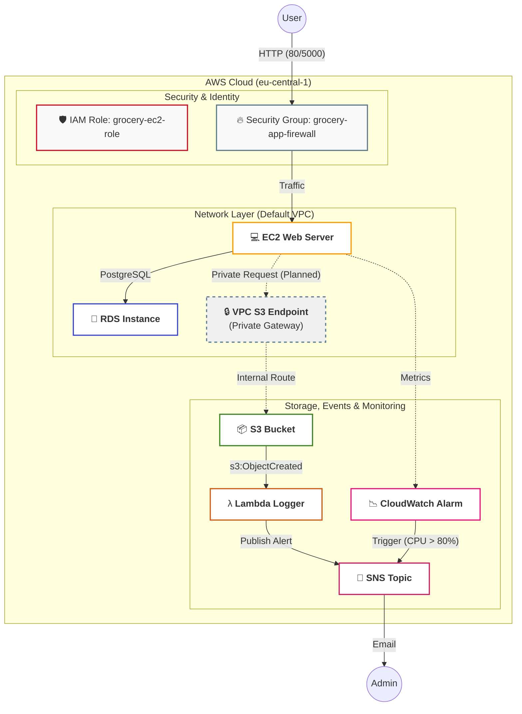

# GroceryMate

[Für das deutsche ReadMe hier klicken](#grocerymate-deutsch)

## 🏆 GroceryMate E-Commerce Platform

[](https://www.python.org/)
[](https://www.kernel.org/)
[](https://www.postgresql.org/)
[](https://github.com/AlejandroRomanIbanez/AWS_grocery/releases/tag/v2.0.0)
[](#-license)

⭐ **Star us on GitHub** — it motivates us a lot!

---

## 📌 Table of Contents

- [Overview](#-overview)
- [Features](#-features)
- [Screenshots & Demo](#-screenshots--demo)
- [Cloud Infrastructure](#-cloud-infrastructure-aws--terraform)
- [Prerequisites](#-prerequisites)
- [Installation](#-installation)
  - [Clone Repository](#-clone-repository)
  - [Configure PostgreSQL](#-configure-postgresql)
  - [Populate Database](#-populate-database)
  - [Set Up Python Environment](#-set-up-python-environment)
  - [Set Environment Variables](#-set-environment-variables)
  - [Start the Application](#-start-the-application)
- [Usage](#-usage)
- [Contributing](#-contributing)
- [License](#-license)

## 🚀 Overview

GroceryMate is an application developed as part of the Masterschools program by **Alejandro Roman Ibanez**, with **Cloud Infrastructure & DevOps automation** designed and implemented by **Youssef El Maach**. It is a modern, full-featured e-commerce platform designed for seamless online grocery shopping. It provides an intuitive user interface and a secure backend, allowing users to browse products, manage their shopping basket, and complete purchases efficiently.

GroceryMate is a modern, full-featured e-commerce platform designed for seamless online grocery shopping. It provides an intuitive user interface and a secure backend, allowing users to browse products, manage their shopping basket, and complete purchases efficiently.

## 🛒 Features

- **🛡️ User Authentication**: Secure registration, login, and session management.
- **🔒 Protected Routes**: Access control for authenticated users.
- **🔎 Product Search & Filtering**: Browse products, apply filters, and sort by category or price.
- **⭐ Favorites Management**: Save preferred products.
- **🛍️ Shopping Basket**: Add, view, modify, and remove items.
- **💳 Checkout Process**:
  - Secure billing and shipping information handling.
  - Multiple payment options.
  - Automatic total price calculation.

## 📸 Screenshots & Demo


https://github.com/user-attachments/assets/d1c5c8e4-5b16-486a-b709-4cf6e6cce6bc


### ☁️ Cloud Infrastructure (AWS & Terraform)

*  **Networking & Connectivity:** Hosted on **AWS EC2** (t2.micro) and **AWS RDS** (PostgreSQL 15). The environment is secured via a **custom Security Group** (`grocery-app-firewall`) controlling traffic on ports **22, 80, 5000, and 5432**.
*  **VPC S3 Endpoint:** Implemented a **Gateway Endpoint** to ensure all traffic between EC2 and S3 remains within the private AWS backbone, improving security and reducing latency at no extra cost.
*  **Storage & Folders:** An **S3 Bucket** (`grocery-yssf`) manages assets with a dedicated `avatars/` directory structure, ensuring organized and scalable object storage.
*  **Identity & Access Management (IAM):** Implemented the **Principle of Least Privilege** using a custom IAM Role (`grocery-ec2-role`). This allows the EC2 instance and Lambda function to interact securely with S3 and SNS without using hardcoded credentials.

⚠️ Note on VPC Endpoint: The S3 Gateway Endpoint is part of the architectural design. In the current deployment, the Terraform resource is documented but commented out due to AWS Service Control Policy (SCP) restrictions in the lab environment.

### 🚨 Serverless (Lambda) Monitoring & Notifications

We implemented a fully decoupled, event-driven pipeline:
*  **S3 Event Trigger:** Automatically detects `s3:ObjectCreated:*` events in the bucket.
*  **AWS Lambda:** A Python-based function ("Logger") that assumes the IAM role to process metadata and log system activity.
*  **SNS Alerts:** Dispatches real-time email notifications via an **SNS Topic**, ensuring the administrator is informed of every successful upload.
*  **Monitoring & Alerting:** Configured a **CloudWatch Metric Alarm** to monitor EC2 CPU utilization. If the load exceeds 80% for more than 2 minutes, an automated notification is triggered via **AWS SNS**, sending a real-time alert to the administrator's email.


## 📋 Prerequisites

Ensure the following dependencies are installed before running the application:

- **🐍 Python (>=3.11)**
- **🐘 PostgreSQL** – Database for storing product and user information.
- **🛠️ Git** – Version control system.

## ⚙️ Installation

### 🔹 Clone Repository

```sh
git clone --branch version2 https://github.com/AlejandroRomanIbanez/AWS_grocery.git && cd AWS_grocery
```

### 🔹 Configure PostgreSQL

Before creating the database user, you can choose a custom username and password to enhance security. Replace `<your_secure_password>` with a strong password of your choice in the following commands.

Create database and user:

```sh
psql -U postgres -c "CREATE DATABASE grocerymate_db;"
psql -U postgres -c "CREATE USER grocery_user WITH ENCRYPTED PASSWORD '<your_secure_password>';"  # Replace <your_secure_password> with a strong password of your choice
psql -U postgres -c "ALTER USER grocery_user WITH SUPERUSER;"
```

### 🔹 Populate Database

```sh
psql -U grocery_user -d grocerymate_db -f backend/app/sqlite_dump_clean.sql
```

Verify insertion:

```sh
psql -U grocery_user -d grocerymate_db -c "SELECT * FROM users;"
psql -U grocery_user -d grocerymate_db -c "SELECT * FROM products;"
```

### 🔹 Set Up Python Environment


Install dependencies in an activated virtual Enviroment:

```sh
cd backend
pip install -r requirements.txt
```
OR (if pip doesn't exist)
```sh
pip3 install -r requirements.txt
```

### 🔹 Set Environment Variables

Create a `.env` file:

```sh
touch .env  # macOS/Linux
ni .env -Force  # Windows
```

Generate a secure JWT key:

```sh
python3 -c "import secrets; print(secrets.token_hex(32))"
```

Update `.env`:

```sh
nano .env
```

Fill in the following information (make sure to replace the placeholders):

```ini
JWT_SECRET_KEY=<your_generated_key>
POSTGRES_USER=grocery_user
POSTGRES_PASSWORD=<your_password>
POSTGRES_DB=grocerymate_db
POSTGRES_HOST=localhost
POSTGRES_URI=postgresql://${POSTGRES_USER}:${POSTGRES_PASSWORD}@${POSTGRES_HOST}:5432/${POSTGRES_DB}
```

### 🔹 Start the Application

```sh
python3 run.py
```

## 📖 Usage

- Access the application at [http://localhost:5000](http://localhost:5000)
- Register/Login to your account
- Browse and search for products
- Manage favorites and shopping basket
- Proceed through the checkout process

## 🤝 Contributing

We welcome contributions! Please follow these steps:

1. Fork the repository.
2. Create a new feature branch (`feature/your-feature`).
3. Implement your changes and commit them.
4. Push your branch and create a pull request.

## 📜 License

This project is licensed under the MIT License.

# GroceryMate Deutsch

## 🏆 GroceryMate E-Commerce-Plattform

[](https://www.python.org/)
[](https://www.kernel.org/)
[](https://www.postgresql.org/)
[](https://github.com/AlejandroRomanIbanez/AWS_grocery/releases/tag/v2.0.0)
[](#-license)

⭐ **Gib uns einen Stern auf GitHub** — das motiviert uns sehr!

---

## 📌 Inhaltsverzeichnis

- [Übersicht](#ubersicht)
- [Funktionen](#-funktionen)
- [Bildschirmfotos & Demo](#-Bildschirmfotos--Demo)
- [Voraussetzungen](#-Voraussetzungen)
- [Installationsanleitung](#-Installationsanleitung)
  - [Repository klonen](#-Repository-klonen)
  - [PostgreSQL konfigurieren](#-PostgreSQL-konfigurieren)
  - [Datenbank befüllen](#-Datenbank-befüllen)
  - [Python-Umgebung einrichten](#-Python-Umgebung-einrichten)
  - [Umgebungsvariablen setzen](#-Umgebungsvariablen-setzen)
  - [Anwendung starten](#-Anwendung-starten)
- [Benutzung](#-Benutzung)
- [Mitwirken](#-Mitwirken)
- [Lizenz](#-Lizenz)

## 🚀 Übersicht

GroceryMate ist eine Anwendung, die im Rahmen des Masterschools-Programms von **Alejandro Roman Ibanez** entwickelt wurde. Es handelt sich um eine moderne, voll ausgestattete E-Commerce-Plattform für ein nahtloses Online-Lebensmittelshopping. Sie bietet eine intuitive Benutzeroberfläche und ein sicheres Backend, mit dem Nutzer Produkte durchsuchen, ihren Warenkorb verwalten und Einkäufe effizient abschließen können.

GroceryMate ist eine moderne, voll ausgestattete E-Commerce-Plattform für ein nahtloses Online-Lebensmittelshopping. Sie bietet eine intuitive Benutzeroberfläche und ein sicheres Backend, mit dem Nutzer Produkte durchsuchen, ihren Warenkorb verwalten und Einkäufe effizient abschließen können.

## 🛒 Funktionen

- **🛡️ Benutzerauthentifizierung**: Sichere Registrierung, Anmeldung und Sitzungsverwaltung.
- **🔒 Geschützte Routen**: Zugriffskontrolle für authentifizierte Nutzer.
- **🔎 Produktsuche & Filter**: Produkte durchsuchen, Filter anwenden und nach Kategorie oder Preis sortieren.
- **⭐ Favoritenverwaltung**: Bevorzugte Produkte speichern.
- **🛍️ Warenkorb**: Artikel hinzufügen, anzeigen, ändern und entfernen.
- **💳 Checkout-Prozess**:
  - Sichere Verarbeitung von Rechnungs- und Lieferinformationen.
  - Mehrere Zahlungsoptionen.
  - Automatische Berechnung des Gesamtpreises.

## 📸 Bildschirmfotos & Demo


https://github.com/user-attachments/assets/d1c5c8e4-5b16-486a-b709-4cf6e6cce6bc

## 📋 Voraussetzungen

Stelle sicher, dass die folgenden Abhängigkeiten installiert sind, bevor du die Anwendung ausführst:

- **🐍 Python (>=3.11)**
- **🐘 PostgreSQL** – Datenbank zur Speicherung von Produkt- und Benutzerinformationen.
- **🛠️ Git** – Versionskontrollsystem.

## ⚙️ Installationsanleitung

### 🔹 Repository klonen

```sh
git clone --branch version2 https://github.com/AlejandroRomanIbanez/AWS_grocery.git && cd AWS_grocery
```

### 🔹 PostgreSQL konfigurieren

Bevor du den Datenbankbenutzer erstellst, kannst du einen benutzerdefinierten Benutzernamen und ein Passwort wählen, um die Sicherheit zu erhöhen. Ersetze `<your_secure_password>` in den folgenden Befehlen durch ein starkes Passwort deiner Wahl.

Datenbank und Benutzer erstellen:

```sh
psql -U postgres -c "CREATE DATABASE grocerymate_db;"
psql -U postgres -c "CREATE USER grocery_user WITH ENCRYPTED PASSWORD '<your_secure_password>';"  # Ersetze <your_secure_password> durch ein starkes Passwort deiner Wahl
psql -U postgres -c "ALTER USER grocery_user WITH SUPERUSER;"
```

### 🔹 Datenbank befüllen

```sh
psql -U grocery_user -d grocerymate_db -f backend/app/sqlite_dump_clean.sql
```

Einfügungen überprüfen:

```sh
psql -U grocery_user -d grocerymate_db -c "SELECT * FROM users;"
psql -U grocery_user -d grocerymate_db -c "SELECT * FROM products;"
```

### 🔹 Python-Umgebung einrichten


Abhängigkeiten in einer aktivierten virtuellen Umgebung installieren:

```sh
cd backend
pip install -r requirements.txt
```
ODER (falls pip nicht existiert)
```sh
pip3 install -r requirements.txt
```

### 🔹 Umgebungsvariablen setzen

Eine .env-Datei erstellen:

```sh
touch .env  # macOS/Linux
ni .env -Force  # Windows
```

Einen sicheren JWT-Schlüssel generieren:

```sh
python3 -c "import secrets; print(secrets.token_hex(32))"
```

.env-Datei aktualisieren:

```sh
nano .env
```

Fülle die folgenden Informationen aus (stelle sicher, dass du die Platzhalter ersetzt):

```ini
JWT_SECRET_KEY=<your_generated_key>
POSTGRES_USER=grocery_user
POSTGRES_PASSWORD=<your_secure_password>
POSTGRES_DB=grocerymate_db
POSTGRES_HOST=localhost
POSTGRES_URI=postgresql://${POSTGRES_USER}:${POSTGRES_PASSWORD}@${POSTGRES_HOST}:5432/${POSTGRES_DB}
```

### 🔹 Anwendung starten

```sh
python3 run.py
```

## 📖 Benutzung

- Greife auf die Anwendung unter [http://localhost:5000](http://localhost:5000) zu
- Registriere dich oder melde dich bei deinem Konto an
- Durchsuche und finde Produkte
- Verwalte Favoriten und den Warenkorb
- Durchlaufe den Checkout-Prozess

## 🤝 Mitwirken

Beiträge zu diesem Projekt sind willkommen! Bitte folge diesen Schritten:

1. Forke das Repository.
2. Erstelle einen neuen Feature-Branch (`feature/your-feature`).
3. Implementiere deine Änderungen und committe sie.
4. Pushe deinen Branch und erstelle einen Pull-Request.

## 📜 Lizenz

Dieses Projekt ist unter der MIT-Lizenz lizenziert.


