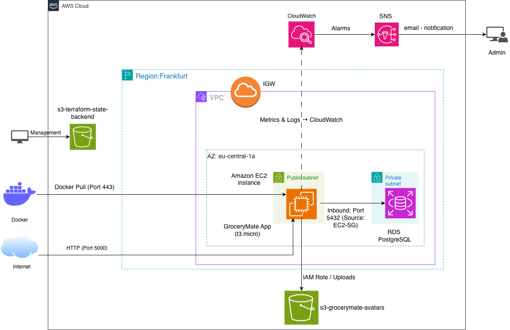

## 🏗️ System Architecture



> **Architecture Overview:** This project deploys a containerized Flask application on AWS using Terraform. 
> It features a secure VPC, RDS PostgreSQL database, and a fully automated monitoring loop using CloudWatch Alarms 
> and SNS notifications.

### 🛠️ Tech Stack & Ports

| Service | Tool/Engine | Port | Purpose |
| :--- | :--- | :--- | :--- |
| **Frontend/API** | Flask (Python) | `5000` | Application Logic |
| **Container** | Docker | N/A | Environment Isolation |
| **Database** | PostgreSQL 16 | `5432` | Persistent Data Storage |
| **IaC** | Terraform | N/A | Infrastructure Automation |
| **Security** | IAM Roles | N/A | Least Privilege Access |


# 🏗️ GroceryMate Infrastructure (AWS & Terraform)

This folder contains the **Infrastructure as Code (IaC)** used to deploy the GroceryMate application to AWS. 
It automates the setup of the network, compute, database, and monitoring layers.

## 🚀 Key Features
- **Remote State:** Terraform state is stored in S3 (`grocerymate-tf-state-gajanan-x12`) for security and collaboration.
- **Containerized Deployment:** The Flask app is pulled from Docker Hub and run on EC2 using a custom `user_data` script.
- **Automated Database Setup:** The RDS PostgreSQL schema and S3-sync triggers are initialized automatically on deployment.

## 📊 AWS Services Used
- **EC2 (t3.micro):** Hosts the Dockerized application.
- **RDS (PostgreSQL 16):** Managed database for application data.
- **S3:** Dual-purpose storage for user avatars and Terraform state.
- **IAM:** Granular roles and policies allowing EC2 to access S3 without hardcoded keys.
- **CloudWatch & SNS:** Proactive monitoring and email alerts for system health.

## 🛡️ Monitoring & Alerts (Week 8 MVP)
I have implemented the following CloudWatch Alarms to ensure system reliability:
1. **High CPU Alarm:** Triggers if EC2 CPU usage exceeds 80% for 4 minutes.
2. **Low Storage Alarm:** Triggers if RDS free space drops below 1GB.
3. **S3 Error Alarm:** Monitors 4xx errors to detect permission or missing file issues.
4. **Billing Alarm:** A global alarm set at $30 USD to prevent unexpected costs.

## 💰 Cost Management & FinOps
To ensure financial accountability, I integrated **Infracost** into my local development workflow. This allowed me to:
- **Estimate Costs Pre-Deployment:** I generated a cost breakdown of the `main.tf` before applying changes.
- **Identify Cost Drivers:** Quickly saw that the RDS instance and NAT Gateways (if used) are the primary cost factors.
- **Budget Alignment:** Verified that the current architecture fits within the AWS Free Tier, maintaining a projected monthly cost of near $0.00 for the first year.

> **Pro-Tip:** I used `infracost breakdown --path .` to verify that my move from a standard instance to a `t3.micro` 
> was the most cost-effective choice for this MVP.

## 🛠️ How to Deploy
1. Ensure your AWS credentials are configured with the correct IAM permissions.
2. Initialize Terraform:
   ```bash
   terraform init
   ```
3. Analyze & Deploy:
   ```bash
   terraform plan
   infracost breakdown --path .   # Review costs before committing
   terraform apply                # Deploy the full stack
   ```
4. Maintenance & Cleanup:
Targeted Refresh:
   ```bash
   terraform apply -replace="aws_instance.web"  # Recreates only the EC2 instance to test user data
   ```
Full Teardown:
   ```bash
   terraform destroy              # Removes all AWS resources
   ```
